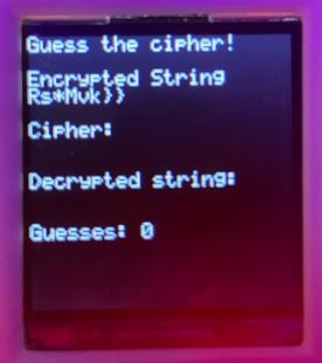
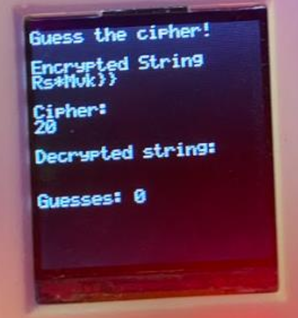
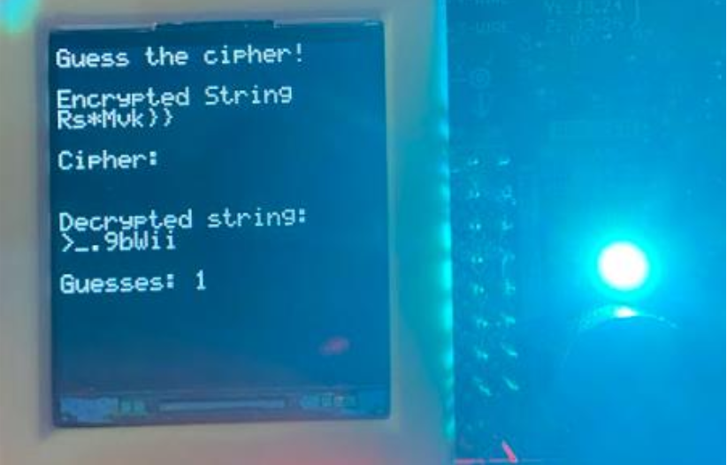

# **Two-Player Cipher Guessing Game**
This project is a two-player game where Player 1 creates a cipher and encrypts a message, while Player 2 attempts to guess the cipher used to reveal the decrypted message. The game provides real-time feedback via an LED system that indicates how close Player 2's guess is to the correct cipher.

## **Game Flow**
**1. Title Screen**

- Displays the title along with instructions for the game.
- Requires any UART input to proceed.
    <td align="center">
         
        <em>Image 1.1: title scree layout</em>
    </td>
**2. Cipher Entry Screen**

- Player 1 enters a numeric cipher (0-9).
- The entered digits are displayed.
- Pressing BB1 confirms the cipher.
    <td align="center">
         
        <em>Image 1.2: Ask for Cipher</em>
    </td>

**3. Encryption Screen**

- Player 1 enters a message for encryption using the chosen cipher.
- The message must be between 1 and 11 characters long.
- Pressing BB1 confirms the message and transitions to the game phase.
    <td align="center">
         
        <em>Image 1.3: Ask for Message</em>
    </td>

**4. Game Screen**

- Displays the encrypted message.
- Player 2 guesses the cipher via UART input.
- If incorrect:
    - The guess counter increments.
    - The decrypted message updates.
    - An LED provides feedback on the proximity of the guess:
        - **Green**: More than 20 away.
        - **Cyan**: 6 to 20 away.
        - **White**: -5 to +5 away.
        - **Magenta**: -6 to -20 away.
        - **Red**: More than -20 away.
    - Player 2 gets another chance.
<table>
  <tr>
    <td align="center">
       
      <em>Image 1.4 - Player 2 Guessing (No Input)</em>
    </td>
    <td align="center">
       
      <em>Image 1.5 - Player 2 Guessing (Input)</em>
    </td>
    <td align="center">
       
      <em>Image 1.6 - Player 2 Guessing (Entered)</em>
    </td>
  </tr>
</table>

**5. Winning Screen**

- If Player 2 correctly guesses the cipher:
    - The LED turns off.
    - A victory message displays along with the number of guesses used.
    <td align="center">
       
      <em>Image 1.7: Win Message</em>
    </td>

## **Key Features**
- **UART Communication**: Manages input and output from a terminal interface.
- **LED Control**: Provides visual feedback based on guess accuracy.
- **LCD Rendering**: Displays game screens and transitions between states.
- **Button Handling**: Moves between game states based on player inputs.

## **Architecture**
The project architecture is divided into two main levels:
- **Board-Level View**: Represents the BoosterPack and LaunchPad connections (buttons, LEDs, LCD, SPI, and UART interfaces).
- **Chip-Level View**: Shows how the MSP432’s peripherals handle UART communication and other inputs.

      
      <em>Image 2.1: Embedded Architecture</em>

## **Hardware Requirements**
- Texas Instruments MSP432 LaunchPad.
- BoosterPack module.
- UART interface for text input.
- Onboard LEDs for feedback.
- Crystalfontz 128x128 LCD display for game UI.
- Push buttons for progressing through the game.

## **Compilation and Execution**
### **Prerequisites**
- **Code Composer Studio (CCS)** or a compatible MSP432 toolchain
- **Texas Instruments MSP432 hardware setup**

### **Building the Project**
1. Open **Code Composer Studio**.
2. Import the project files into your workspace.
3. Compile and flash the project to the MSP432 board.
4. Open a serial terminal (e.g., **PuTTY**) to interact via UART.

## **How to Run**
### **1. Setup the Hardware**
Connect the **MSP432 LaunchPad** with the **BoosterPack**, ensuring all buttons, joystick, LEDs, and LCD are correctly wired.

### **2. Compile the Code**
Use **Code Composer Studio** or your preferred IDE configured for the **MSP432**. Ensure all **HAL and driver library paths** are correctly set.

### **3. Flash the Device**
Upload the compiled binary to the **MSP432**.

